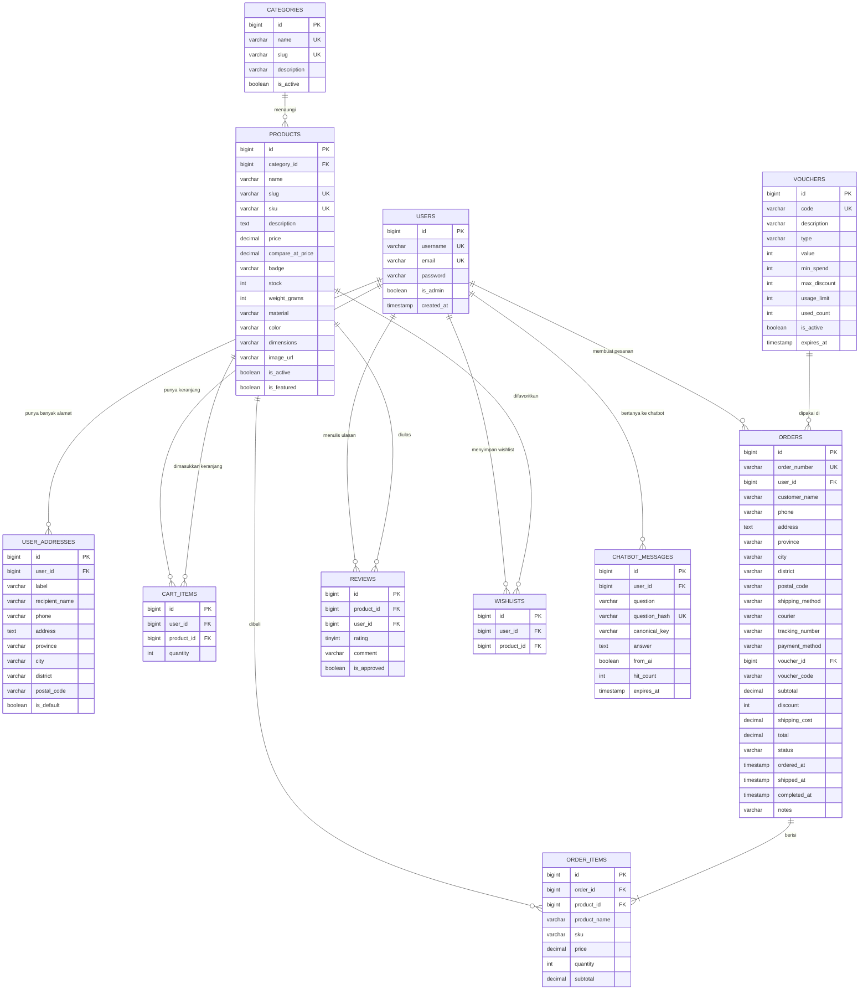
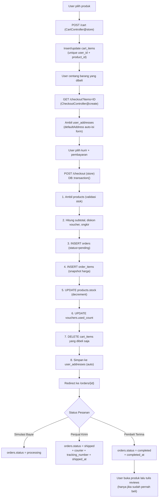
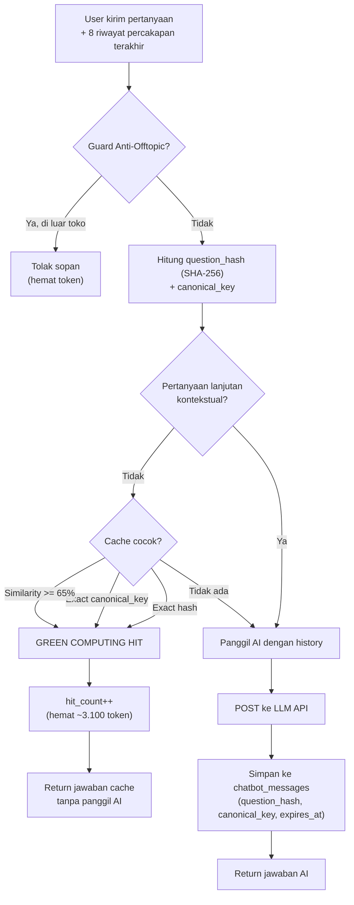
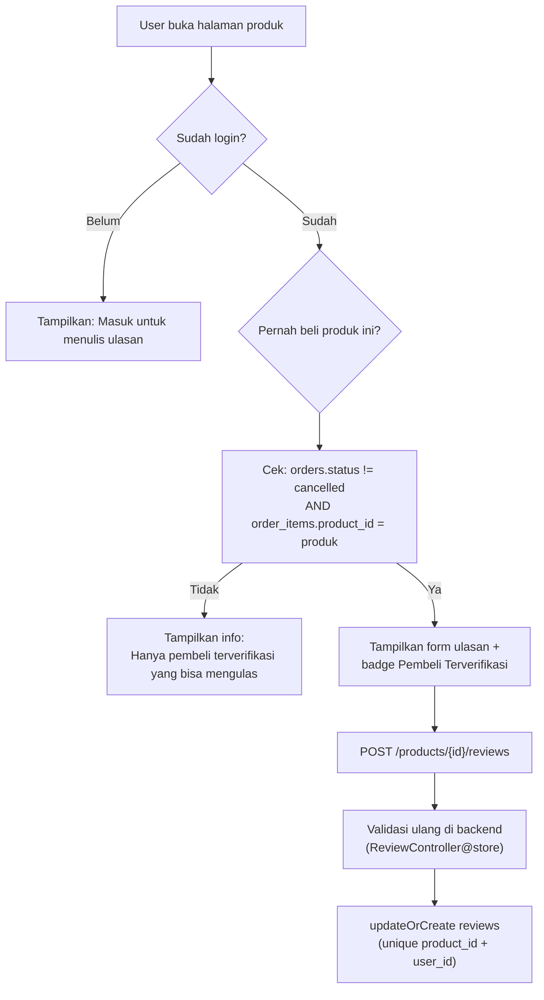

# FLOW & DIAGRAM DATABASE — VINZYPLAY E-COMMERCE

> Dokumen ini menjelaskan **seluruh struktur database**, **relasi antar tabel**, **alur data transaksi**, serta **diagram visual (Mermaid)** yang bisa langsung dirender di GitHub, VS Code, Notion, Obsidian, atau Mermaid Live Editor.

---

## 1. Ringkasan Database

* **DBMS**: PostgreSQL 16 (Neon Serverless Cloud)
* **Tabel inti aplikasi**: 13 tabel
* **Tabel bawaan Laravel**: `sessions`, `cache`, `cache_locks`, `jobs`, `job_batches`, `failed_jobs`, `password_reset_tokens`
* **Karakteristik**: transaksi ACID, foreign key dengan kebijakan cascade/restrict/set-null, unique composite anti-duplikasi, dan index untuk performa.

---

## 2. Daftar Tabel & Fungsinya

| # | Tabel | Fungsi |
|---|---|---|
| 1 | `users` | Akun pengguna (pelanggan & admin) |
| 2 | `user_addresses` | Buku alamat pengiriman tersimpan (auto-isi checkout) |
| 3 | `categories` | Kategori produk (Keyboard, Audio, Diecast, dll) |
| 4 | `products` | Katalog produk |
| 5 | `cart_items` | Isi keranjang belanja per pengguna |
| 6 | `orders` | Header pesanan (alamat, kurir, resi, status, total) |
| 7 | `order_items` | Rincian barang per pesanan (snapshot harga) |
| 8 | `vouchers` | Kode promo & diskon |
| 9 | `reviews` | Ulasan & rating (khusus pembeli terverifikasi) |
| 10 | `wishlists` | Produk favorit pengguna |
| 11 | `chatbot_messages` | Cache jawaban chatbot AI (Green Computing) |
| 12 | `sessions` | Sesi login (bawaan Laravel) |
| 13 | `cache`, `cache_locks`, `jobs`, `job_batches`, `failed_jobs`, `password_reset_tokens` | Infrastruktur framework |

---

## 3. Diagram ERD Lengkap (Mermaid)

> Render di https://mermaid.live atau GitHub Markdown.



---

## 4. Relasi & Kebijakan Foreign Key (ON DELETE)

| Tabel. Kolom | Mengarah ke | ON DELETE | Makna Bisnis |
|---|---|---|---|
| `products.category_id` | `categories.id` | **RESTRICT** | Kategori tidak bisa dihapus jika masih ada produk |
| `cart_items.user_id` | `users.id` | **CASCADE** | Hapus user → keranjang terhapus |
| `cart_items.product_id` | `products.id` | **CASCADE** | Hapus produk → hilang dari keranjang |
| `orders.user_id` | `users.id` | **RESTRICT** | Riwayat pesanan dilindungi (user tak bisa dihapus) |
| `order_items.order_id` | `orders.id` | **CASCADE** | Hapus order → rincian ikut terhapus |
| `order_items.product_id` | `products.id` | **SET NULL** | Hapus produk → riwayat pesanan tetap tersimpan |
| `orders.voucher_id` | `vouchers.id` | **SET NULL** | Hapus voucher → order tetap valid |
| `reviews.product_id` | `products.id` | **CASCADE** | Hapus produk → ulasannya ikut terhapus |
| `reviews.user_id` | `users.id` | **CASCADE** | Hapus user → ulasannya ikut terhapus |
| `wishlists.user_id` | `users.id` | **CASCADE** | Hapus user → wishlist terhapus |
| `wishlists.product_id` | `products.id` | **CASCADE** | Hapus produk → hilang dari wishlist |
| `chatbot_messages.user_id` | `users.id` | **SET NULL** | Cache chatbot tetap ada (anonymized) |
| `user_addresses.user_id` | `users.id` | **CASCADE** | Hapus user → buku alamat terhapus |

**Catatan:** `sessions.user_id` hanya punya INDEX tanpa FK constraint.

---

## 5. Unique Constraints (Anti Duplikasi)

| Tabel | Kolom Unik | Tujuan |
|---|---|---|
| `users` | `username` | Username tidak boleh sama |
| `users` | `email` | Email tidak boleh sama |
| `categories` | `name`, `slug` | Kategori unik |
| `products` | `sku`, `slug` | Kode produk & URL unik |
| `cart_items` | `(user_id, product_id)` | 1 produk hanya 1 baris di keranjang |
| `orders` | `order_number` | Nomor pesanan unik |
| `reviews` | `(product_id, user_id)` | **1 ulasan per user per produk** |
| `wishlists` | `(user_id, product_id)` | Produk tidak dobel di wishlist |
| `vouchers` | `code` | Kode voucher unik |
| `chatbot_messages` | `question_hash` | 1 cache per hash pertanyaan |

---

## 6. Index untuk Optimasi Performa

| Tabel | Index | Fungsi |
|---|---|---|
| `products` | `(is_active, category_id)` | Filter produk aktif per kategori |
| `orders` | `(user_id, ordered_at)` | Daftar pesanan user terurut |
| `orders` | `(status, ordered_at)` | Filter pesanan per status |
| `reviews` | `(product_id, is_approved)` | Rating rata-rata produk |
| `chatbot_messages` | `expires_at` | Lookup cache yang masih fresh |
| `chatbot_messages` | `canonical_key` | Pencocokan pertanyaan mirip (Green Computing) |
| `user_addresses` | `(user_id, is_default)` | Ambil alamat utama user dengan cepat |

---

## 7. ALUR DATA: CHECKOUT & PESANAN



---

## 8. ALUR DATA: CHATBOT AI & GREEN COMPUTING



---

## 9. ALUR DATA: ULASAN TERVERIFIKASI



---

## 10. Kamus Kolom Penting (Status & Enum)

### `orders.status`
| Nilai | Label | Arti |
|---|---|---|
| `pending` | Menunggu | Pesanan dibuat, belum dibayar |
| `processing` | Diproses | Lunas, penjual menyiapkan barang |
| `shipped` | Dikirim | Paket diserahkan kurir + nomor resi terbit |
| `completed` | Selesai | Paket diterima pembeli |
| `cancelled` | Dibatalkan | Pesanan dibatalkan |

### `orders.payment_method`
| Nilai | Arti |
|---|---|
| `bank_transfer` | Transfer Bank / Virtual Account |
| `cod` | Bayar di Tempat |

### `orders.shipping_method`
| Nilai | Arti |
|---|---|
| `regular` | Kurir reguler (2-4 hari, bebas ongkir min. Rp300rb) |
| `express` | Kurir kilat (1 hari, Rp25.000) |

### `vouchers.type`
| Nilai | Arti |
|---|---|
| `percent` | Diskon persentase (mis. 10% -> value = 10) |
| `fixed` | Potongan nominal tetap (mis. Rp15.000 -> value = 15000) |

### `chatbot_messages` (Green Computing)
| Kolom | Arti |
|---|---|
| `question_hash` | SHA-256 dari pertanyaan ternormalisasi (exact match) |
| `canonical_key` | Kata kunci baku terurut (mis. `harga playstation 5`) untuk pertanyaan mirip |
| `hit_count` | Berapa kali jawaban dipakai ulang (basis hemat token & energi) |
| `expires_at` | Batas waktu cache (default 60 menit) |

---

## 11. Diagram Sederhana (Teks ASCII) untuk Presentasi Cepat

```
                        +-------------+
                        |   USERS     |
                        +------+------+
             +-------------+---+----+-----------+------------+
             v             v        v           v            v
     +--------------+ +---------+ +--------+ +--------+ +--------------+
     | USER_ADDRESS | |CART_ITEM| | ORDERS | |REVIEWS | |  WISHLISTS   |
     +--------------+ +----+----+ +---+----+ +---+----+ +------+-------+
                           |          |          |             |
                           v          v          |             |
                     +----------+ +------------+ |             |
                     | PRODUCTS |<|ORDER_ITEMS | +-------------+
                     +----+-----+ +------------+
                          |
                  +-------+--------+
                  v                v
           +------------+   +------------+
           | CATEGORIES |   |  VOUCHERS  |<-- (voucher_id di ORDERS)
           +------------+   +------------+

     +-----------------------+
     |  CHATBOT_MESSAGES     |  <-- Cache jawaban AI (Green Computing)
     |  question_hash (UK)   |
     |  canonical_key (IDX)  |
     |  hit_count            |
     |  expires_at (IDX)     |
     +-----------------------+
```

---

## 12. Kesimpulan Arsitektur

1. **Normalisasi data**: kategori, produk, pesanan, dan item pesanan dipisah mengikuti bentuk 3NF.
2. **Integritas referensi**: foreign key dengan kebijakan tepat (CASCADE untuk data transien, RESTRICT untuk data historis, SET NULL untuk referensi opsional).
3. **Snapshot historis**: `order_items` menyimpan nama, SKU, dan harga produk saat pembelian agar riwayat tidak berubah walau produk diedit/dihapus.
4. **Anti-duplikasi**: unique composite menjamin satu ulasan, satu wishlist, dan satu baris keranjang per produk per user.
5. **Green Computing**: `chatbot_messages` menyimpan `question_hash`, `canonical_key`, dan `hit_count` untuk mengukur penghematan token LLM, energi listrik (kWh), dan emisi karbon (CO2e).
6. **Auto-fill alamat**: `user_addresses` dengan flag `is_default` mempercepat checkout berulang.

---

*Dokumen ini dibuat berdasarkan struktur migrasi aktual aplikasi VinzyPlay E-Commerce.*
